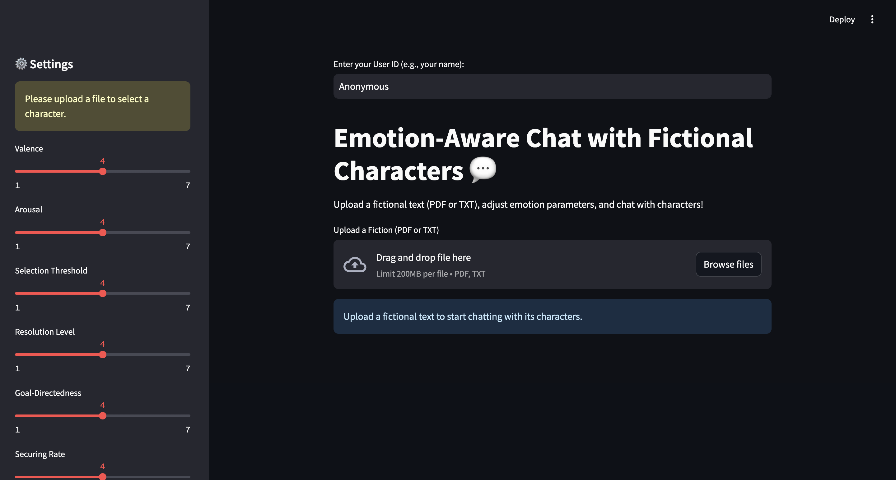

# Emotion-Aware Chat with Fictional Characters

Welcome to **Emotion-Aware Chat**, an interactive application that lets you chat with fictional characters from uploaded texts (PDF or TXT files). The characters respond with emotions—anger, sadness, and joy—based on slider settings and the sentiment of your messages. Built with a Streamlit frontend, Flask backend, and SQLite database, this project combines natural language processing, sentiment analysis, and a custom emotional model for a dynamic chat experience.

  

## Features

- **Upload Fictional Texts**: Analyze PDF or TXT files to extract characters and their speaking styles.
- **Emotion-Aware Responses**: Characters adjust their tone (angry, sad, joyful) based on:
  - User-defined sliders (valence, arousal, etc.).
  - Sentiment analysis of your messages (e.g., annoying them increases anger, praising them boosts joy).
- **Chat History**: Persists conversations in an SQLite database with timestamps and emotional states.
- **Modular Design**: Separates frontend (Streamlit), backend (Flask), and database logic for scalability.

## Prerequisites

- **Python 3.9+**: Ensure you have a compatible Python version installed.
- **Dependencies**: Listed in `requirements.txt`.

## Installation

1. **Clone the Repository**:
   ```bash
   git clone https://github.com/Betty987/emotion-chat.git
   cd emotion-chat

2. **Set Up a Virtual Environment**:
   ```bash
   python -m venv venv
   source venv/bin/activate  # On Windows: venv\Scripts\activate
2. **Install Dependencies**:
   ```bash
   pip install -r requirements.txt
   
## Running the Application

1. **Start the Backend**:
   ```bash
   python backend.py

2. **Start the Frontend**:
   ```bash
   streamlit run frontend.py
2. **Interact**:
   ```bash
   Enter a User ID (e.g., "Beth").
   Upload a fictional text (PDF or TXT) to extract characters.
   Select a character, adjust sliders, and start chatting.


## Project Structure
```
emotion-chat/
├── frontend.py       # Streamlit frontend for user interaction
├── backend.py        # Flask backend with emotional model and API
├── database.py       # SQLite database functions
├── requirements.txt  # Project dependencies
└── chat_history.db   # SQLite database (generated at runtime)
```
## Dependencies
Listed in requirements.txt:

- streamlit: Frontend framework.
- flask: Backend API server.
- requests: HTTP client for frontend-backend communication.
- langchain-groq: Language model integration.
- langchain-community: Document loaders.
- pypdf: PDF parsing.
- sqlite3: Database support.
- textblob: Sentiment analysis.

